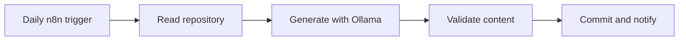

### Building intelligent systems that run locally, solve practical problems, and improve through iteration.

## About me

I am a B.Tech Computer Science student specializing in Cyber Security, with a growing focus on **Artificial Intelligence, Machine Learning, and Data Science**. I enjoy turning ideas into working projects—from predictive ML applications to local AI agents and automated workflows.

- 🤖 Exploring local AI agents with **Ollama, MCP, and n8n**
- 📊 Building end-to-end **machine-learning and data-science projects**
- 🔐 Interested in responsible automation, privacy, and secure credential handling
- 🌱 Currently learning **RAG, agent evaluation, MLOps, and production AI systems**
- 🎯 Goal: build practical AI products with measurable real-world value

## Featured systems

| Project | What it does | Core technologies |
|---|---|---|
| [AI News Agent](https://github.com/Pranay-6669/ai-news-agent) | Collects recent AI news through RSS, processes it with a local model, and returns a structured response through an n8n webhook. | n8n, Ollama, RSS, Webhooks |
| [AI Job Hunter](https://github.com/Pranay-6669/ai-job-hunter) | Extracts a candidate profile from a resume, searches for relevant jobs, and delivers formatted job alerts. | n8n, Ollama, APIs, Gmail |
| [Local MCP Server](https://github.com/Pranay-6669/mcp-server) | Lets a local Ollama model discover and call Python MCP tools, use their results, and produce a final response. | Python, MCP, Ollama, Pytest |

## Current build: 12-day AI maintenance experiment

I designed a local n8n workflow that performs one focused documentation task per day across my three repositories. It reads the existing project, uses Ollama locally, validates the generated content, creates a GitHub commit, and sends an email notification.

> The goal is meaningful project maintenance—not empty activity. Generated documentation is constrained to existing project facts and should still be reviewed.

## Technical toolkit

## Progress roadmap

- [x] Machine-learning foundations and model evaluation
- [x] End-to-end ML applications with FastAPI and Streamlit
- [x] Workflow automation with n8n and local LLMs
- [x] MCP server with tool discovery and tool calling
- [ ] Retrieval-Augmented Generation with evaluation
- [ ] Reproducible MLOps pipelines and monitored deployment
- [ ] Production-ready multi-agent application

## GitHub activity

---

### Learn deeply. Build honestly. Improve continuously.

